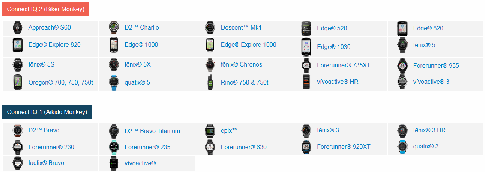

# Official Reference

https://developer.garmin.com/connect-iq/user-experience-guide/appendices/

# Copy of Official Reference

|Device|Resolution (px)|Icon Resolution|Colors|Available Button Functions|Screen Type|Touch Screen|
|---|---|---|---|---|---|---|
|Approach®S60|240 x 240|40 x 33|64|enter, back, menu|round|Yes|
|Edge® 520|200 x 265|35 x 35|65536|up, down, enter, back, start, lap|rectangle|No|
|Edge® 820, edge Explore 820|200 x 265|35 x 35|65536|start, lap|rectangle|Yes|
|Edge® 1000, Edge Explore 1000|240 x 400|36 x 36|65536|start, lap|rectangle|Yes|
|epix®|205 x 148|40 x 40|64|up, down, enter, back, menu|rectangle|Yes|
|fēnix® 3, fēnix® 3 HR, D2® Bravo, D2® Bravo Titanium, tactix® Bravo, quatix® 3|218 x 218|40 x 40|16|up, down, enter, back, menu|round|No|
|fēnix® 5S|218 x 218|36 x 36|64|up, down, enter, back, menu|round|No|
|fēnix® 5, fēnix® 5X, Forerunner® 935, quatix&reg 5|240 x 240|40 x 40|64|up, down, enter, back, menu|round|No|
|fēnix® Chronos|218 x 218|36 x 36|64|up, down, enter, back, menu|round|No|
|Forerunner® 230, 235, 735XT|215 x 180|40 x 40|16|up, down, enter, back, menu|semi-round|No|
|Forerunner® 630|215 x 180|40 x 40|16|lap, enter, back, menu|semi-round|Yes|
|Forerunner® 920XT|205 x 148|65 x 65|16|up, down, enter, back, menu|rectangle|No|
|Oregon® 7xx|240 x 400|36 x 36|65536|none|rectangle|Yes|
|Rino® 7xx|240 x 400|36 x 36|65536|none|rectangle|Yes|
|vívoactive®|205 x 148|61 x 43|64|enter, back, menu|rectangle|Yes|
|vívoactive HR®|148 x 205|40 x 33|64|enter, back, menu|tall|Yes|

# Devices missing from official documenation
|Device|Resolution (px)|Icon Resolution|Colors|Available Button Functions|Screen Type|Touch Screen|
|---|---|---|---|---|---|---|
| D2 Charlie | 240x240 | ? | A lot | ? | round | ? |
| Descent Mk1 | 240x240 | ? | A lot | ? | round | ? |
| fēnix® 5 Plus | 240x240 | ? | A lot | ? | round | ? |
| fēnix® 5x Plus | 240x240 | ? | A lot | ? | round | ? |
| fēnix® 5s Plus | 240x240 | ? | A lot | ? | round | ? |
| Forerunner® 645 | 240x240 | ? | A lot | ? | round | ? |
| Forerunner® 645 Music | 240x240 | ? | A lot | ? | round | ? |

# device vivoactive3 gesture
shape ROUND and TOUCH
*4 regions :* 
|-x-|-y-|
|---|---|
| 106 | 153 |
| 346 | 153 |
| 346 | 393 |
| 106 | 393 |

*behaviors*

gesture="SWIPE_RIGHT" =>"ON_BACK" 
gesture="SWIPE_LEFT" 
gesture="SWIPE_UP" ==> "NEXT_PAGE" 
gesture="SWIPE_DOWN" => "PREVIOUS_PAGE" 
gesture="HOLD" => "ON_MENU" 
gesture="RELEASE" 
gesture="TAP" => "ON_SELECT" 

*une touche*
id="ENTER"

<point x="385" y="245" />
<point x="419" y="245" />
<point x="419" y="300" />
<point x="385" y="300" />

# Round is the New Black
If you are seeing a pattern with the fēnix® family of products, the Forerunner® 935, the Approach® S60, and now the vívoactive 3, it is not coincidence: Garmin likes round watches. We like them because they look like watches instead of “wearable technology”. Yes, a rectangular display can hold more information, and yes, our devices capture and display much more information than a traditional wrist watch, but if it does not look good on the user’s wrist none of that matters.

# Watch Faces
Watch faces work the same on the vívoactive 3 as they do on the fēnix 5 and the Forerunner 935. The vívoactive 3 supports always active watch faces as well, meaning your custom watch faces can stay always on and update every second while still having industry leading battery life.

# Data Fields
When using three or more data fields on the vívoactive 3, the top and bottom fields are much smaller and designed for metrics that can be represented in simple terms, and the vívoactive 3 will not allow users to place Connect IQ data fields into the top/bottom areas. Otherwise, your data field should run just fine on the vívoactive 3.

# Device Behaviors
The vívoactive 3 is our first one button watch. The _button_ is used for _start/stop_, and there is no physical “back” button. The *BehaviorDelegate* will map a number of screen actions to behaviors:

# Right swipe is now Back
Hold on the screen is now Menu
Swipe up and down is now Previous and Next page
If your app currently overrides the above actions (right swipe, hold, or swiping up and down), they will interfere with the native actions of the vívoactive 3. If you are using the BehaviorDelegate to capture menu and back behaviors, your app will work without modification on the vívoactive 3.

# Use Selectables, Menus, and the Picker
Make sure to take advantage of Menus and the Picker. These will always adapt to the native look and feel to the device and take advantage of input changes.

The vívoactive 3 has a capacitive touch screen that you can take advantage of. The Selectables and Buttons framework, introduced in Connect IQ 2, makes it easy to design an interface that can be used by both touch and button products. At the Connect IQ Summit we gave a presentation about how to use Selectables and Buttons when designing your user interface.

# Datafield:
0,50 - 68 h
0,120 - 69 h

#SDK version support

||||
|--- |--- |--- |
|1.2.x Devices (Aikido)|1.4.x Devices (Aikido)|2.1.x Devices (Biker)|
|epix|D2 Bravo|Approach S60|
||D2 Bravo Titanium|D2 Charlie|
||Forerunner 230|Edge 520|
||Forerunner 235|Edge 820|
||Forerunner 630|Edge Explore 820|
||Forerunner 920XT|Edge 1000|
||fenix 3|Edge Explore 1000|
||fenix 3 HR|Forerunner 735XT|
||quatix 3|Forerunner 935|
||tactix Bravo|fenix 5|
||vivoactive|fenix 5S|
|||fenix 5X|
|||fenix Chronos|
|||Oregon 7xx Series|
|||quatix 5|
|||Rino 7xx Series|
|||vivoactive HR|

Fenix 3 : MEDIUM 29, TINY 22, XTINY 18
  NUM mEDIUM 60,  NUM MILD 32 

Fenix 5 MEDIUM 34 SMALL 29 TINY 26 
  NUM MED 36 MILD 26 HOT 52
  